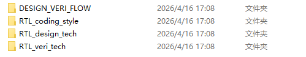

1. CPU run flow in hardware view;
2. 软件如何控制硬件跑起来；
3. LLM + obsidian 生成可自我迭代知识库; DONE
4. cm0 Task7 硬件代码 review;
5. verilator+gtkwave自动化跑起来; 
6. wavedrom写jsom直接生成波形？
7.  整理？
8. 
9. cm0 音乐播放器这颗soc可以跑多少MHz ？