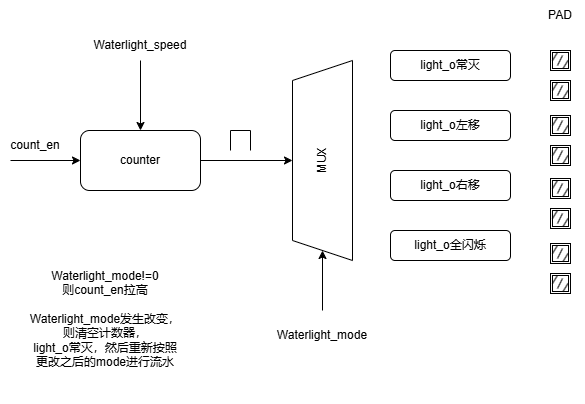

信号名             位宽       输入/输出       含义
clk     [0:0]                input          模块运行时钟，使用AHB时钟，50M
rstn    [0:0]                input          模块复位是cpuresetn，模块本身不用做异步复位，同步释放
WaterLight_speed [31:0]      input          流水灯速度控制，计数器上限，支持流水灯模块运行期间动态可配
WaterLight_mode  [1:0]       input          流水灯模式控制，一共有4种模式，支持流水灯模块运行期间动态可配：
                                            全灭模式：所有灯都不亮；
                                            左移模式：同一时间点亮一个灯，依次左移，WaterLight_mode 对应输入为 0x01；
                                            右移模式：同一时间点亮一个灯，依次右移，WaterLight_mode 对应输入为 0x02；
                                            闪烁模式：所有灯同时闪烁，WaterLight_mode 对应输入为 0x03；
light_o          [7:0]       output         流水灯输出

寄存器名          位域        读写属性   复位值     含义
WaterLight_speed [31:0]      R/W         32’b0    流水灯速度控制，计数器上限，支持流水灯模块运行期间动态可配
WaterLight_mode  [1:0]       R/W          2'b0    流水灯模式控制，一共有4种模式，支持流水灯模块运行期间动态可配：

一个为 WaterLight_speed 用于控制流水灯的流水速度；
另一个为 WaterLight_mode 用于控制硬件流水灯的 4 种输出模式；
流水灯模式控制寄存器 WaterLight_mode地址为 0x40000000，流水灯速度控制寄存器 WaterLight_speed 地址为 0x40000004；

那么rstn如何产生？ 
cpuresetn

流水灯硬件模块是怎么知道自己需要何时启动的？
当WaterLight_mode！=0时，启动；

电路结构：

数据流：
CPU配置WaterLight_mode和Waterlight_speed寄存器，无明确顺序；
WaterLight_mode！=0时，启动计数器计数，每当计数器技数到Waterlight_speed后，产生一个脉冲，cnt_pls，此脉冲用于驱动8个PAD的导通和关闭，
具体导通和关闭方案按照WaterLight_mode规定进行，
左移模式：每当来一个脉冲，则向左环形移位，初始pattern是8'h01；
右移模式：每当来一个脉冲，则向右环形移位，初始pattern是8'h80；
闪烁模式：每当来一个脉冲，则8个PAD进行一次翻转；
全灭模式：计数器清0，8个PAD不输出；

note:
1.Waterlight_mode!=0
则count_en拉高

2.Waterlight_mode或Waterlight_speed发生改变，则清空计数器，
light_o常灭，然后重新按照更改之后的mode或speed进行流水灯；

### copilot补充说明（寄存器、复位、采样、验证）

为避免实现与固件/仿真不一致，请将以下要点并入设计文档并与 RTL 保持同步。

1) 寄存器映射（示例，按实际 RTL 对齐并填写复位值）

    - `0x4000_0000` : `WaterLight_mode` [1:0] RW 复位=0 说明：0=全灭，1=左移，2=右移，3=闪烁
    - `0x4000_0004` : `WaterLight_speed` [31:0] RW 复位=0 说明：计数器上限，以时钟周期为单位

2) `WaterLight_speed` 单位与示例

    - 单位：以模块时钟周期为单位（本 SoC 时钟 `clk=50MHz`）。
    - 示例：
      - `speed = 100_000` → 周期约 2 ms（50MHz 时钟）
      - `speed = 5_000_000` → 周期约 0.1 s
      - `speed = 50_000_000` → 周期约 1 s
    - 设计下限：`speed` 小于 100_000 时模块不启动（此为设计选择，请在文档注明原因）。

3) 配置/启动顺序与采样时点（强制且明确）

    - 固件顺序：先写 `WaterLight_speed`，再写 `WaterLight_mode`（写入 `mode` 后模块才开始计数）。
    - 硬件行为：对 `mode`/`speed` 不使用影子寄存器， 当 `mode` 或 `speed` 改变时，计数器清 0，`light_o` 置为静态（全灭），直到工作寄存器生效并按新配置运行。

4) 初始 pattern 与环形移位说明

    - 复位/启动时 `light_o` 初始值请明确8’h00。
    - 左/右移采用环形移位（rotate），即移出的位会回绕到另一端，避免显式边界判断。可在 RTL 中用 `assign pattern = (pattern << 1) | (pattern >> (8-1));` 或使用循环寄存器实现。

5) 仿真与验证用例（最少包含以下项）

    - 用例 A（上电复位）：上电后复位断言/释放，断言 `mode=0` 且 `light_o=0x00`。
    - 用例 B（配置流程）：写入 `speed=100000` → 写入 `mode=1` → 观察 `light_o` 在预期时间点开始左移。
    - 用例 C（边界 speed）：写入 `speed = lower-1`（应不启动）与 `speed = lower`（应启动），检查行为差异。
    - 用例 D（mode 切换）：运行中修改 `mode`，检查计数器是否清 0 且 `light_o` 暂灭后按新模式运行。
    - 用例 E（非法/超界）：写入超大 `speed` 值与随机数据，验证系统不会死锁或异常输出。

6) `$readmemh` 路径可移植性

    - `Block_RAM.v` 中请避免使用硬编码的绝对 Windows 路径（例如 `E:/.../code.hex`），改为相对路径或通过参数传入：
      - 例如 `parameter HEX_FILE = "keil/code.hex"; initial $readmemh(HEX_FILE, mem);`。
    - 在文档中加入仿真说明（工作目录、如何传参），提高可移植性。

7) 建议（可选，但有利于调试）

    - 增加只读 `STATUS` 寄存器（`running/mode/current_pattern`），便于软件与仿真断言（非必须，但推荐）。
    - 在文档末尾添加“版本/验证记录”段，记录测试通过的时间与用例，便于后续维护。

1. 描述不清晰的地方：

复位来源：文中写了 那么rstn如何产生？ cpuresetn，但没有明确模块应使用哪个复位（系统全局复位 rstn 还是 CPU 的 cpuresetn），也没说明异步/同步复位策略和复位后的默认寄存器值。
CPU 的 cpuresetn
寄存器在AHBlite_WaterLight.v中已经写好硬件逻辑，包括复位后的默认值；

时钟域与频率：只写了“使用AHB时钟”，未说明频率、分频或计数器基准（WaterLight_speed 的单位是周期数还是毫秒/μs）。
Task3的soc设计中，只有一个时钟，就是clk,此时钟也是AHB时钟；

寄存器地址矛盾/来源未说明：文档里写 WaterLight_mode 地址 0x40000000、WaterLight_speed 地址 0x40000004，但工程中软件/反汇编显示实际访问为 0x40000020 与 0x40000028（见之前反汇编结果）。未说明地址映射来源（AHB从属地址偏移）。
现在是Task3，忽略Task2中的反汇编；

寄存器写时的原子性与 byte-enable：未说明 CPU 写寄存器时是否需要考虑 byte-enable（AHB 的 WEA/字节掩码），也未说明寄存器位域与字节序。
寄存器在AHBlite_WaterLight.v中已经写好硬件逻辑，包括复位后的默认值；

mode 值的具体定义：虽然列出 4 种模式，但没有规定非法值如何处理（如 0x04、0xFF），也没明确 WaterLight_mode 的位含义（低位含义或位掩码）。
mode更改为2bit，现在已无非法值；也不需明确 WaterLight_mode 的位含义；

速度为 0 或极小值的语义：WaterLight_speed 为 32 位，但未定义 0、1 等边界含义（会否产生持续高频脉冲或直接静止）。
WaterLight_speed只有在大于10^5时，计数器才启动，否则直接静止；

启动条件模糊：说“当 WaterLight_mode != 0 时启动”但没有说明是否需要写 outEn/使能寄存器或是否需要软件先写 speed 再写 mode。
需要软件先写 speed 再写 mode；

2. 相互矛盾的地方：

寄存器地址冲突：文档地址 0x40000000/0x40000004 与代码/反汇编看到的 0x40000020/0x40000028 不一致；需统一或注明映射偏移（例如外设基址不同）。
现在是Task3，忽略Task2中的反汇编；

“全灭模式计数器不工作” 与 “mode 改变要清空计数器”：若全灭时计数器停，且 mode 改变要清空计数器，切换到非零 mode 后计数器是否立即从 0 开始计数产生脉冲，文档未描述清楚可能产生的竞态。
全灭时计数器清0；

复位信号命名/来源矛盾：文中同时出现 rstn 和 cpuresetn，未说明哪一个用于模块复位。
cpuresetn用于模块复位；

3. 在哪些场景下会失效：

软件地址不一致：如果固件继续写 0x40000020/28 而硬件实际映射到 0x40000000/04（或反之），GPIO 不会被配置或点亮。
现在是Task3，忽略Task2中的反汇编；

速度为 0 或过小：未定义 speed=0 的行为，可能导致除零/无脉冲或瞬时高频切换，烧坏 LED 或看不到预期效果。
WaterLight_speed只有在大于10^5时，计数器才启动，否则直接静止；

非对齐/部分写入：CPU 使用字节写（byte-enable）写入寄存器时若硬件未处理 byte-en，会导致寄存器只写低字节或出现错值。
cpu不存在字节写（byte-enable）写入寄存器，一次写1个word;

异步/擦除竞态：当软件在计数器中途修改 mode/speed，若硬件无缓冲/同步机制，会产生短暂错误的输出（例如在 shift 过程中出现两个灯同时亮）。
Waterlight_mode或Waterlight_speed发生改变，则清空计数器，
light_o常灭，然后重新按照更改之后的mode或speed进行流水灯；

复位/上电时序：如果 rstn 与 cpuresetn 不一致，模块可能在 CPU 尚未就绪时开始工作或保持锁死状态。
rstn 与 cpuresetn一致；

计数器溢出或时间尺度不合适：若 WaterLight_speed 设得非常大/非常小，视觉效果或仿真可能不可接受；未设上限会导致假死或看不出效果。
下限是10^5，上限是2^32-1
